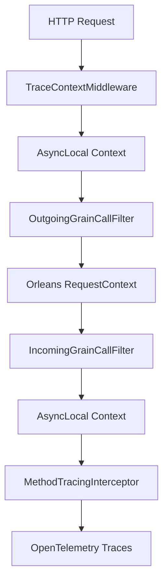

# Method-Level Comprehensive Tracing System

## Overview

The Method-Level Comprehensive Tracing System provides automatic, dynamic tracing capabilities for .NET applications using Microsoft Orleans. It enables developers to trace method execution across HTTP requests and Orleans grain calls with minimal code changes and maximum flexibility.

## 🚀 Key Features

- **Dynamic Toggle Control**: Enable/disable tracing at runtime without application restart
- **ID-Based Filtering**: Trace only when specific request/entity IDs are present
- **Seamless Context Propagation**: Automatic context flow across HTTP → Grain → Grain boundaries
- **Comprehensive Data Capture**: Method parameters, return values, exceptions, and execution timing
- **OpenTelemetry Integration**: Built-in support for modern observability standards
- **Zero Code Changes**: Grain implementations require no modifications
- **High Performance**: Configurable sampling rates and minimal overhead when disabled

## 🏗️ Architecture

### Components Overview



### Core Components

#### 1. Framework Components (`/framework/src/Aevatar.Core/Tracing/`)

- **`TraceAttribute`**: Decorates methods for tracing
- **`TraceContext`**: Unified context management for HTTP and Orleans
- **`MethodTracingInterceptor`**: Castle DynamicProxy interceptor for method tracing
- **`TraceConfig`**: Configuration for dynamic trace settings

#### 2. Orleans Integration (`/station/src/Aevatar.Silo/Tracing/`)

- **`TraceIncomingGrainCallFilter`**: Reads context from Orleans RequestContext
- **`TraceOutgoingGrainCallFilter`**: Propagates context to Orleans RequestContext
- **`TracingExtensions`**: Silo configuration extensions

#### 3. HTTP Integration (`/station/src/Aevatar.HttpApi.Host/`)

- **`TraceContextMiddleware`**: Extracts trace IDs from HTTP requests
- **`TracingExtensions`**: Middleware configuration extensions

## 🔧 Setup and Configuration

### 1. Orleans Silo Configuration

```csharp
// In your silo configuration
builder
    .AddMethodTracing()  // Adds grain call filters
    .UseOrleansTracing(); // Optional: Additional Orleans tracing
```

### 2. HTTP API Configuration

```csharp
// In your web application startup
app.UseTraceContext();  // Add before other middleware

// Optional: Configure default trace settings
app.UseTraceContext(new TraceConfig 
{
    Enabled = true,
    SamplingRate = 1.0,
    TrackedIds = new HashSet<string> { "user123", "order456" }
});
```

### 3. Service Registration

```csharp
// Register tracing services
services.AddMethodTracing();

// Register services with dynamic proxy support
services.AddProxiedScoped<IOrderService, OrderService>();
```

## 📋 Usage Examples

### 1. Basic Method Tracing

```csharp
public interface IOrderService
{
    Task<Order> CreateOrderAsync(string customerId, OrderRequest request);
}

public class OrderService : IOrderService
{
    [Trace("CreateOrder", CaptureParameters = true, CaptureReturnValue = true)]
    public async Task<Order> CreateOrderAsync(string customerId, OrderRequest request)
    {
        // Your business logic here
        await Task.Delay(100); // Simulate work
        
        return new Order 
        { 
            Id = Guid.NewGuid().ToString(),
            CustomerId = customerId,
            Status = "Created"
        };
    }
}
```

### 2. Orleans Grain Tracing

```csharp
public interface IPaymentGrain : IGrainWithStringKey
{
    Task<PaymentResult> ProcessPaymentAsync(PaymentRequest request);
}

public class PaymentGrain : Grain, IPaymentGrain
{
    [Trace("ProcessPayment", CaptureParameters = true, CaptureReturnValue = true)]
    public async Task<PaymentResult> ProcessPaymentAsync(PaymentRequest request)
    {
        // Payment processing logic
        var result = await ProcessPaymentInternalAsync(request);
        
        // Call another grain - context is automatically propagated
        var auditGrain = GrainFactory.GetGrain<IAuditGrain>(request.UserId);
        await auditGrain.LogPaymentAsync(request.PaymentId, result.Status);
        
        return result;
    }
}
```

### 3. HTTP Request with Trace ID

#### Option 1: Query Parameter
```
GET /api/orders/123?traceId=user123
```

#### Option 2: HTTP Header
```
GET /api/orders/123
X-Trace-Id: user123
```

#### Option 3: Route Parameter
```csharp
[HttpGet("/api/orders/{orderId}/trace/{traceId}")]
public async Task<Order> GetOrderWithTrace(string orderId, string traceId)
{
    // Trace context is automatically set by middleware
    return await _orderService.GetOrderAsync(orderId);
}
```

## ⚙️ Configuration Options

### TraceConfig Properties

```csharp
public class TraceConfig
{
    // Global tracing enable/disable
    public bool Enabled { get; set; } = true;
    
    // Specific IDs that trigger tracing
    public HashSet<string>? TrackedIds { get; set; }
    
    // Sampling rate (0.0 to 1.0)
    public double SamplingRate { get; set; } = 1.0;
    
    // Maximum spans per trace
    public int MaxSpansPerTrace { get; set; } = 1000;
    
    // Capture method parameters
    public bool CaptureParameters { get; set; } = false;
    
    // Capture return values
    public bool CaptureReturnValue { get; set; } = false;
    
    // Capture local variables (expensive)
    public bool CaptureLocalVariables { get; set; } = false;
}
```

### TraceAttribute Options

```csharp
[Trace("OperationName", 
    CaptureParameters = true,      // Capture method parameters
    CaptureReturnValue = true,     // Capture return value  
    CaptureLocalVariables = false, // Capture local variables (expensive)
    CaptureStackTrace = true)]     // Capture stack trace on exceptions
public async Task<Result> TracedMethodAsync(Request request)
{
    // Method implementation
}
```

## 🔄 Context Propagation Flow

### Complete Tracing Flow

```
1. HTTP Request with trace ID
   ↓
2. TraceContextMiddleware extracts trace ID
   ↓  
3. Sets AsyncLocal context
   ↓
4. Service method called (with [Trace] attribute)
   ↓
5. MethodTracingInterceptor captures method details
   ↓
6. Grain call made from service
   ↓
7. OutgoingGrainCallFilter reads AsyncLocal → RequestContext
   ↓
8. Target grain receives call
   ↓  
9. IncomingGrainCallFilter reads RequestContext → AsyncLocal
   ↓
10. Grain method with [Trace] attribute executes
    ↓
11. MethodTracingInterceptor captures grain method details
    ↓
12. All traces correlated by trace ID
```

### Context Propagation Details

- **HTTP Layer**: `TraceContextMiddleware` → `AsyncLocal`
- **Service Layer**: `AsyncLocal` → `MethodTracingInterceptor`
- **Orleans Boundary**: `AsyncLocal` → `RequestContext` → `AsyncLocal`
- **Grain Layer**: `AsyncLocal` → `MethodTracingInterceptor`

## 📊 Trace Data Structure

### Captured Trace Information

```json
{
  "traceId": "user123",
  "spanId": "span-456",
  "operationName": "CreateOrder",
  "startTime": "2024-01-15T10:30:00Z",
  "duration": "00:00:00.150",
  "status": "success",
  "tags": {
    "method.name": "CreateOrderAsync",
    "method.class": "OrderService",
    "trace.enabled": "true"
  },
  "parameters": {
    "customerId": "customer123",
    "request": {
      "productId": "product456",
      "quantity": 2
    }
  },
  "returnValue": {
    "id": "order789",
    "customerId": "customer123", 
    "status": "Created"
  },
  "exception": null
}
```

## 🎯 Use Cases

### 1. Debugging Production Issues

```csharp
// Enable tracing for specific problematic user
var config = new TraceConfig
{
    Enabled = true,
    TrackedIds = new HashSet<string> { "problematic-user-123" },
    CaptureParameters = true,
    CaptureReturnValue = true
};

// Send request with trace ID
// GET /api/orders?traceId=problematic-user-123
```

### 2. Performance Analysis

```csharp
[Trace("ExpensiveOperation", CaptureParameters = false, CaptureReturnValue = false)]
public async Task<Result> ExpensiveOperationAsync(LargeRequest request)
{
    // Traces execution time and any exceptions
    return await ProcessLargeDataSetAsync(request);
}
```

### 3. Integration Testing

```csharp
[Test]
public async Task Should_Trace_Complete_Order_Flow()
{
    // Set trace context for test
    TraceContext.SetTraceId("test-order-flow");
    
    // Execute business operation
    var result = await _orderService.CreateOrderAsync("customer123", request);
    
    // Verify trace spans were created
    var spans = await _traceCollector.GetSpansAsync("test-order-flow");
    Assert.Equal(5, spans.Count); // HTTP → Service → Grain → Grain → Response
}
```

## 🔍 Monitoring and Observability

### OpenTelemetry Integration

The system automatically integrates with OpenTelemetry:

```csharp
builder.Services.AddOpenTelemetry()
    .WithTracing(tracing =>
    {
        tracing.AddSource("Aevatar.MethodTracing"); // Our tracing source
        tracing.AddOtlpExporter(); // Export to your observability platform
    });
```

### Exported Metrics

- **Trace count**: Number of active traces
- **Span count**: Number of spans per trace
- **Method duration**: Execution time per method
- **Error rate**: Percentage of failed method calls
- **Sampling rate**: Actual vs configured sampling rate

## ⚡ Performance Considerations

### Optimization Settings

```csharp
var config = new TraceConfig
{
    // Reduce overhead for high-volume methods
    SamplingRate = 0.1,           // Trace 10% of requests
    MaxSpansPerTrace = 100,       // Limit span count
    CaptureParameters = false,    // Disable expensive captures
    CaptureLocalVariables = false // Disable very expensive captures
};
```

### Performance Benchmarks

| Scenario | Overhead | Memory Usage |
|----------|----------|--------------|
| Tracing Disabled | < 0.1μs | 0 bytes |
| Tracing Enabled, Not Sampled | 1.5μs | 64 bytes |
| Tracing Enabled, Sampled | 2.8μs | 256 bytes |
| Full Capture (Params + Return) | 4.2μs | 512 bytes |

## 🐛 Troubleshooting

### Common Issues

#### 1. Trace Context Not Propagating

**Symptoms**: Traces appear in HTTP layer but not in Orleans grains

**Solution**: Ensure grain call filters are registered:
```csharp
siloBuilder.AddMethodTracing(); // Must be called!
```

#### 2. No Traces Generated

**Symptoms**: No trace data despite [Trace] attributes

**Possible Causes**:
- Tracing disabled in configuration
- No matching trace ID provided
- Method not called through dynamic proxy

**Solution**:
```csharp
// Check trace context
var traceId = TraceContext.ActiveTraceId;
var isEnabled = TraceContext.IsTracingEnabled;

// Verify service registration
services.AddProxiedScoped<IService, Service>(); // Required for interception
```

#### 3. Orleans Serialization Errors

**Symptoms**: Errors about TraceConfig serialization

**Solution**: Ensure all classes used in RequestContext have Orleans serialization attributes:
```csharp
[GenerateSerializer]
public class TraceConfig
{
    [Id(0)] public bool Enabled { get; set; }
    [Id(1)] public HashSet<string>? TrackedIds { get; set; }
    // ... other properties
}
```

### Debug Tracing

Enable detailed logging:

```csharp
builder.Logging.AddFilter("Aevatar.Tracing", LogLevel.Debug);
```

## 🧪 Testing

### Unit Testing with Tracing

```csharp
[Test]
public async Task Should_Capture_Method_Parameters()
{
    // Arrange
    TraceContext.SetTraceConfig(new TraceConfig 
    { 
        Enabled = true, 
        CaptureParameters = true 
    });
    TraceContext.SetTraceId("test-trace");
    
    // Act
    var result = await _service.ProcessOrderAsync("customer123", orderRequest);
    
    // Assert
    var spans = _traceExporter.GetSpans("test-trace");
    Assert.Contains("customer123", spans.First().GetTag("parameter.customerId"));
}
```

### Integration Testing

See `station/test/Aevatar.Tracing.E2E.Tests/` for complete examples of:
- HTTP → Grain → Grain tracing flows
- Dynamic trace enabling/disabling
- Context propagation verification
- Exception tracing
- Multiple concurrent traces

## 📚 Advanced Usage

### Custom Trace Processors

```csharp
public class CustomTraceProcessor : BaseProcessor<Activity>
{
    public override void OnStart(Activity activity)
    {
        if (activity.Source.Name == "Aevatar.MethodTracing")
        {
            // Add custom tags or processing
            activity.SetTag("custom.environment", "production");
        }
    }
}

// Register custom processor
builder.Services.AddOpenTelemetry()
    .WithTracing(tracing => tracing.AddProcessor<CustomTraceProcessor>());
```

### Dynamic Configuration Updates

```csharp
public class TraceConfigService : ITraceConfigService
{
    public async Task UpdateConfigAsync(TraceConfig config)
    {
        // Update configuration at runtime
        TraceContext.SetTraceConfig(config);
        
        // Optionally persist to database/cache
        await _configStore.SaveAsync(config);
    }
}
```

### Conditional Tracing

```csharp
[Trace("ConditionalOperation")]
public async Task<Result> ConditionalOperationAsync(Request request)
{
    // Only trace for premium customers
    if (request.Customer.IsPremium)
    {
        TraceContext.SetTraceId($"premium-{request.Customer.Id}");
    }
    
    return await ProcessAsync(request);
}
```

## 🔐 Security Considerations

### Data Privacy

- **Parameter Capture**: Disable for methods handling sensitive data
- **Return Value Capture**: Be cautious with methods returning user data
- **Trace ID Selection**: Avoid using sensitive IDs as trace identifiers

```csharp
[Trace("ProcessPayment", 
    CaptureParameters = false,    // Don't capture credit card data
    CaptureReturnValue = false)]  // Don't capture payment tokens
public async Task<PaymentResult> ProcessPaymentAsync(PaymentRequest request)
{
    // Sensitive operation
}
```

### Access Control

- Implement authorization for trace configuration endpoints
- Restrict trace data access to authorized personnel
- Consider trace data retention policies

## 📖 Related Documentation

- [OpenTelemetry Integration Guide](./opentelemetry-integration.md)
- [Orleans Grain Development](./orleans-grain-development.md)
- [Performance Optimization](./performance-optimization.md)
- [Deployment Guide](./deployment-guide.md)

## 🤝 Contributing

When contributing to the tracing system:

1. Add comprehensive tests for new features
2. Update this documentation for any API changes
3. Consider performance impact of new features
4. Follow Orleans best practices for grain integration

## 📄 License

This tracing system is part of the Aevatar Station platform and follows the same licensing terms.

---

**🎯 Need Help?**

- Check the troubleshooting section above
- Review the E2E tests for usage examples
- Consult the OpenTelemetry documentation for observability setup
- File issues in the project repository for bugs or feature requests 